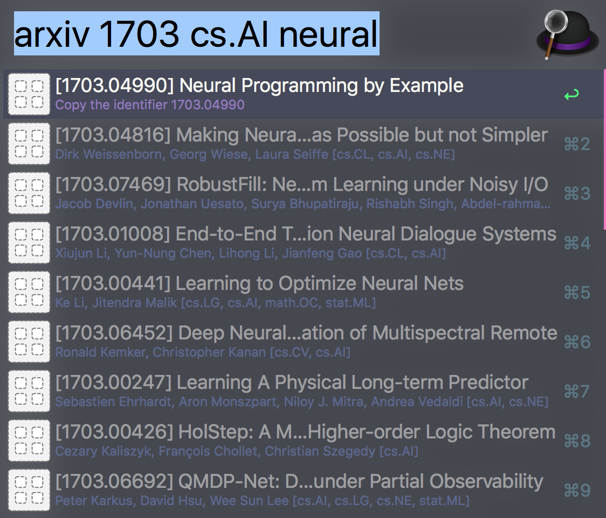

Alfred arXiv Workflow
=====================

Alfred 3 workflow to search via [arXiv search API](https://arxiv.org/help/api/index).

<p align="center">

</p>

Usage: `arxiv <query>`


Install
-------

From v2.0, the workflow is written in the [alfy](https://github.com/sindresorhus/alfy/) framework, so you can install via `npm`.

```
npm install --global alfred-arxiv
```

Requires Node.js >= 14.0 (ESM).


Authors
-------

Jongwook Choi (@wookayin)


License
-------

[The MIT License](LICENSE)
